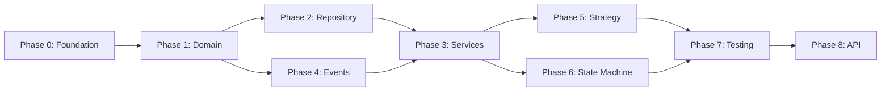

# Enter365 Backend Major Refactoring Plan

> **Mission**: Transform Enter365 from a good Laravel application into an enterprise-grade, maintainable, testable, and observable ERP backend that will stand the test of time.

## Executive Summary

This refactoring plan addresses technical debt while improving:
- **Stability**: Robust error handling, state machines, validation layers
- **Testability**: Dependency injection, repository pattern, isolated domain logic
- **Extensibility**: Strategy pattern, plugin architecture, event-driven design
- **Flexibility**: Configurable behaviors, swappable implementations
- **Observability**: Structured logging, metrics, distributed tracing

---

## Current State Assessment

### What's Already Good
| Area | Status | Notes |
|------|--------|-------|
| Domain Layer (app/Domain/) | Partial | Sales, Purchasing, Accounting have state machines |
| Contracts/Interfaces | Good | All major services have interfaces |
| Strategy Pattern | Good | COGS, Inventory, Manufacturing, Closing strategies |
| Event Infrastructure | Good | EventDispatcherInterface with Laravel/Null implementations |
| Base Classes | Good | AbstractDocumentService, AbstractStateMachine |
| Test Coverage | Good | 2493 tests (501 unit + 1992 feature), 259 test files |
| DI Configuration | Good | Well-organized in AppServiceProvider |

### What Needs Improvement
| Area | Priority | Impact |
|------|----------|--------|
| Service Layer Inconsistency | High | Some extend AbstractDocumentService, others don't |
| Domain Layer Gaps | High | Manufacturing, Inventory missing full domain structure |
| Observability | High | No structured logging, metrics, or tracing |
| Event Registration Sprawl | Medium | 200+ lines in AppServiceProvider |
| Repository Pattern | Medium | Direct Eloquent queries hard to test/swap |
| Value Objects | Medium | Complex types passed as arrays |
| Error Handling | Medium | Inconsistent across modules |

---

## Phase Overview

| Phase | Name | Duration | Risk | Focus |
|-------|------|----------|------|-------|
| [0](./01-phase-0-foundation.md) | Foundation & Observability | 1-2 weeks | Low | Logging, metrics, exception handling |
| [1](./02-phase-1-domain-layer.md) | Domain Layer Consolidation | 2-3 weeks | Medium | Complete all domain structures |
| [2](./03-phase-2-repository-pattern.md) | Repository Pattern | 2 weeks | Medium | Abstract data access layer |
| [3](./04-phase-3-service-layer.md) | Service Layer Refinement | 2 weeks | Medium | SOLID principles, consistency |
| [4](./05-phase-4-event-driven.md) | Event-Driven Architecture | 1-2 weeks | Low | Better event handling |
| [5](./06-phase-5-strategy-expansion.md) | Strategy Pattern Expansion | 1 week | Low | More flexibility points |
| [6](./07-phase-6-state-machine.md) | State Machine Enhancement | 1 week | Low | Workflow robustness |
| [7](./08-phase-7-testing.md) | Testing Infrastructure | 2 weeks | Low | Testability improvements |
| [8](./09-phase-8-api-layer.md) | API Layer Clean-up | 1 week | Low | Controllers, resources |

**Total Estimated Duration**: 12-16 weeks

---

## Principles Guiding This Refactor

### 1. SOLID Principles
- **S**ingle Responsibility: One reason to change per class
- **O**pen/Closed: Open for extension, closed for modification
- **L**iskov Substitution: Subtypes must be substitutable
- **I**nterface Segregation: Many specific interfaces over one general
- **D**ependency Inversion: Depend on abstractions, not concretions

### 2. Domain-Driven Design (Tactical)
- **Entities**: Models with identity (Invoice, WorkOrder)
- **Value Objects**: Immutable types (Money, DateRange, Address)
- **Aggregates**: Consistency boundaries (Invoice with Items)
- **Domain Events**: Important occurrences (InvoicePaid)
- **Domain Services**: Operations that don't belong to entities

### 3. Clean Architecture Layers
```
┌─────────────────────────────────────────┐
│           Presentation Layer            │
│      (Controllers, Resources, API)      │
├─────────────────────────────────────────┤
│           Application Layer             │
│    (Services, Commands, Queries)        │
├─────────────────────────────────────────┤
│             Domain Layer                │
│  (Entities, Value Objects, Events)      │
├─────────────────────────────────────────┤
│          Infrastructure Layer           │
│  (Repositories, External Services)      │
└─────────────────────────────────────────┘
```

### 4. Event-Driven Architecture
- Domain events for cross-cutting concerns
- Loose coupling between modules
- Audit trails and debugging support

---

## Critical Path



**Critical Dependencies:**
1. Phase 0 (Foundation) must be done first - it provides observability for all subsequent changes
2. Phase 1 (Domain) provides the base for Phases 2, 3, 4
3. Phase 3 (Services) requires 2 and 4 to be complete
4. Phase 7 (Testing) should follow service refactoring

---

## Success Metrics

### Code Quality
- [ ] All services implement interfaces
- [ ] All domain logic in Domain layer
- [ ] Zero direct Eloquent calls in application services (use repositories)
- [ ] 100% of state transitions go through state machines

### Observability
- [ ] All service methods log entry/exit at debug level
- [ ] All errors logged with context
- [ ] Key business metrics captured
- [ ] Distributed tracing for cross-service calls

### Testability
- [ ] Unit test coverage > 70% for domain logic
- [ ] Integration test coverage > 60% for services
- [ ] All tests pass with in-memory/mock repositories

### Performance (No Regression)
- [ ] API response times remain < 200ms (p95)
- [ ] No N+1 queries introduced
- [ ] Memory usage stable

---

## Risk Mitigation

| Risk | Probability | Impact | Mitigation |
|------|-------------|--------|------------|
| Breaking existing functionality | Medium | High | Extensive test suite, phased rollout |
| Performance regression | Low | Medium | Benchmark before/after each phase |
| Scope creep | Medium | Medium | Strict phase boundaries, no gold-plating |
| Team unfamiliarity with patterns | Medium | Medium | Documentation, pair programming |

---

## How to Use This Plan

### For Developers
1. Start with Phase 0 (Foundation)
2. Follow each phase document's step-by-step guide
3. Run tests after each significant change
4. Update documentation as you go

### For Code Review
1. Check that changes align with the target architecture
2. Verify tests cover new code
3. Ensure observability is maintained

### For AI Agents
1. Reference the relevant phase document
2. Follow the exact patterns specified
3. Do not skip steps or gold-plate
4. Run tests and Pint after changes

---

## Phase Documents

1. [Phase 0: Foundation & Observability](./01-phase-0-foundation.md)
2. [Phase 1: Domain Layer Consolidation](./02-phase-1-domain-layer.md)
3. [Phase 2: Repository Pattern](./03-phase-2-repository-pattern.md)
4. [Phase 3: Service Layer Refinement](./04-phase-3-service-layer.md)
5. [Phase 4: Event-Driven Architecture](./05-phase-4-event-driven.md)
6. [Phase 5: Strategy Pattern Expansion](./06-phase-5-strategy-expansion.md)
7. [Phase 6: State Machine Enhancement](./07-phase-6-state-machine.md)
8. [Phase 7: Testing Infrastructure](./08-phase-7-testing.md)
9. [Phase 8: API Layer Clean-up](./09-phase-8-api-layer.md)

---

## Appendices

- [Appendix A: Current Architecture Diagram](./appendix-a-current-architecture.md)
- [Appendix B: Target Architecture Diagram](./appendix-b-target-architecture.md)
- [Appendix C: Migration Checklists](./appendix-c-checklists.md)
